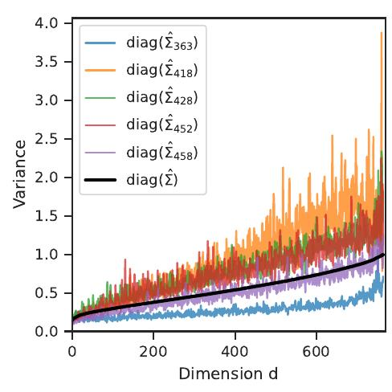
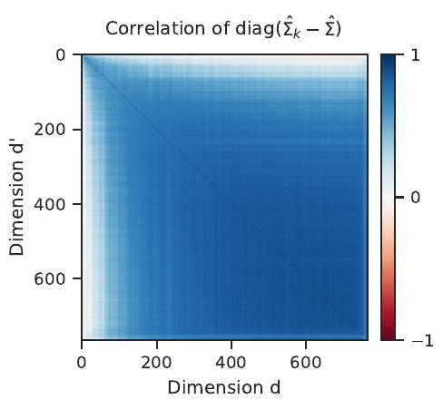
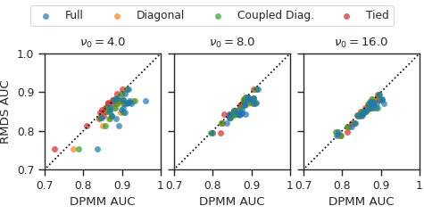
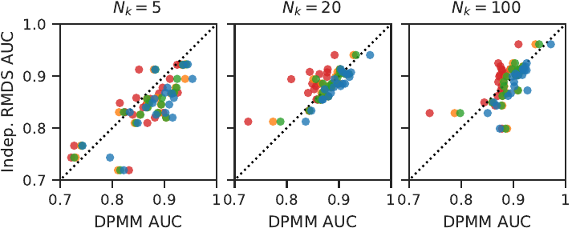

# Bayesian Non-parametrics for Out-of-distribution Detection
Bayesian non-parametrics are a natural solution for out-of-distribution (OOD) detection
problems as they model the probabilty that a sample is generated from a unknown
cluster (_i.e._ an outlier). Here we provide implementations of hierarchical
Dirichlet process mixture models (DPMM) with Gaussian likelihoods for OOD
detection. We provide expectation maximization methods for efficient inference
and demonstrate their effectiveness of our approach on the
[OpenOOD](https://zjysteven.github.io/OpenOOD/) benchmark. 
We analyze the covariance structure of the ViT-B/16 (DeiT) features for the Imagenet dataset
which motivates the application of hierarchical DPMMs and the coupled hierarchical DPMM with diagonal covariance
[here](./ImagenetDataAnalysis.ipynb).
We also generate synthetic datasets to demonstate the performance of our
approach in different data regimes [here](./SyntheticExperiments.ipynb).
For full details on our approach and experiments, please see our paper
["A Bayesian Nonparametric Perspective on Mahalanobis Distance for Out of Distribution Detection"]().

## Imagenet Dataset Analysis
The covariance analysis figures discussed in the paper can be generated using the notebook
[ImagenetDataAnalysis.ipynb](./ImagenetDataAnalysis.ipynb). We
highlight that the diagonal elements of the empirical covariance matrices
$\hat{\Sigma}_k$ are scaled up or down versions of their average $\hat{\Sigma}$.
This analysis motivates the coupled hierarchical DPMM with diagonal covariance.

<kbd>
  
  
</kbd>


## Synthetic Data Experiments
We sweep over the $\nu_0$ parameter of the NIW prior used to generate the synthetic data to demonstrate the sensitivity of different models to how tied the class covariances are, as shown in the figure below.

<kbd>
  
</kbd>

We also sweep over the number of samples per class $N_k$. We see that compared to the independent RMDS model, the hierarchical DPMMs are more robust to small $N_k$.

<kbd>
  
</kbd>

The experiments can be recreated in the notebook [SyntheticExperiments.ipynb](./SyntheticExperiments.ipynb).

## OpenOOD Experiments

<table>
<tr>
  <td colspan=2> 
  <td colspan=3 style="text-align:center;">Near</td>
  <td colspan=4 style="text-align:center;">Far</td>
</tr>
<tr>
  <td > Model <td > Accuracy <td > SSB Hard <td > NINCO <td > Avg.  <td > iNaturalist <td >OpenImageO  <td >Textures <td > Avg.
</tr>
<tr>
    <td> MSP <td><b> 80.89
            <td> 71.75 <td> 79.87 <td> 75.81
            <td> 88.66 <td> 85.62 <td> 84.62 <td> 86.30
</tr>
<tr>
    <td> Temp. MSP <td><b> 80.89 
                <td> 73.29 <td> 81.27 <td> 77.28
                <td> 91.23 <td> 87.81 <td> 86.78 <td> 88.61
</tr>
<tr>
    <td> MDS <td> 80.41
            <td> 71.45 <td> 86.48 <td> 78.97
            <td> 96.00 <td> 92.34 <td> 89.38 <td> 92.57
</tr>
<tr>
    <td> RMDS <td> 80.41
            <td> 72.79 <td> 87.28 <td> 80.03
            <td><b> 96.09 <td> 92.29 <td> 89.38 <td> 92.59 
</tr>
<tr>
    <td colspan=9 style="text-align:center;">Hierarchical DPMMs 
</tr>
<tr>
<td> Tied <td> 80.41
          <td> 71.80 <td> 86.76 <td> 79.28
          <td> 96.00 <td><b> 92.40 <td><b> 89.72 <td><b> 92.70
</tr>
<tr>
<td> Full   <td> 76.79
            <td> 62.84 <td> 78.48 <td> 70.66 
            <td> 85.88 <td> 85.03 <td> 88.02 <td> 86.31
</tr>
<tr>
<td> Diag.  <td> 76.54
            <td> 73.89 <td> 87.32 <td> 80.60
            <td> 95.36 <td> 90.78 <td> 86.41 <td> 90.85
</tr>
<tr>
<td> Coupled  <td> 76.51
              <td><b> 74.47 <td><b> 87.48 <td><b>80.98
              <td> 95.51 <td> 90.63 <td> 86.02 <td> 90.72
</tr>
</table>

Scripts are provided in [scripts/](./scripts/) to reproduce all of the OpenOOD experiments in the paper.
The scripts save results with the following directory structure:
```
bnp4ood/
    openood_exps/
        {MODEL_NAME}/ # Model names: mds-rmds, full, tied, diag, coupled_diag
            logs/
            results/
```
The [OpenOOD_Results notebook](./OpenOOD_Results.ipynb) generates the tables presented in the paper from the saved results.


## Installation
Ensure that the required python packages in
[requirements.txt](./requirements.txt) are installed.

## Vision Transformer Features
### Downloading Features
We provide the features we generated from the OpenOOD experiments in our release
[here](https://github.com/rwl93/bnp4ood). Before running the experiments, you
need to combine `vit-b-16-img1k-feats-part*.pkl` by running the script:
```sh
python combine_partial_feats.py --feats-file-prefix vit-b-16-img1k-feats
rm vit-b-16-img1k-feats-part*.pkl
```

### Regenerating Features
To generate the features for the OpenOOD experiments, you will need to install
the OpenOOD benchmark [available here](https://github.com/Jingkang50/OpenOOD).
We provide a script to extract the features from the OpenOOD benchmark,
[available here](./third_party/openood/extract_imagenet_features.py),
that saves the features in the following format:
```
# ID Datasets
{MODEL_NAME}-img1k-feats.pkl # Train
{MODEL_NAME}-img1k-{ID_SPLIT}-feats.pkl # ID Splits: val, test

# OOD Datasets
# OOD Granularities: near, far
# OOD Datasets: ssb_hard, ninco, inaturalist, textures, openimages-o
{MODEL_NAME}-img1k-{OOD_GRANULARITY}_{DATASETNAME}-feats.pkl
```
where dataset names are the lowercase names of each dataset. To run this script,
copy it to the `OpenOOD/scripts/` directory and run the following command:
```sh
python openood/extract_imagenet_features.py --model_name {MODEL_NAME}
```
Once the features have been saved, link or copy them to this repository with the same names.